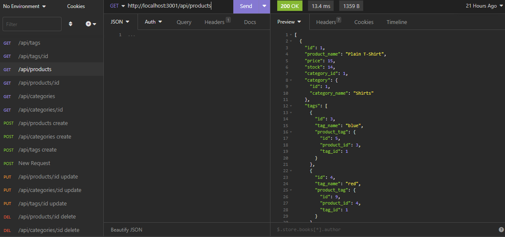

# E-Commerce Application
  
  ## Description
  The E-Commerce application is an API that is fully functional and future proof through the use of MYSQL2 and Sequelize. My job on this project was to refactor the code to be more flexible and forward thinking. When you run the application, all routes work appropriately and display product, tag, category, and product id information for an e commerce database.

  

  ## Table of Contents
  * [Installation](#installation)

  * [Usage](#usage)

  * [License](#license)

  * [Contributing](#contributing)

  * [Questions](#questions)

  * [Credits](#credits)

  

  ## Installation
  Clone the repository onto your local machine. Open the file in your preferred code editor. First, open an integrated terminal in the Develop folder and type npm i to install all dependencies. Once finished, rename the .envExample file to .env for your mysql login. Then open the .env file and type in your username and password for MySQL inside the '' where it says DB_USER and DB_PW. Once that is completed then open an integrated terminal from the Develop Folder. Login into MySQL in the terminal and type in create database ecommerce_db; Once completed, quit MySQL. In the terminal type in node seeds/index.js and then you will be able to use all of the api get/put/post/delete routes.
    
  ## Usage
  Once you have followed all of the installation instructions you can start the server by typing node server.js in the integrated terminal. Once you have started the server you can open your preferred REST API client to make your HTTP requests.

  Below is a screenshot of the API running in Insomnia.

  

  Usage Link: https://drive.google.com/file/d/1BDb7E-NURRQ5_vzvKqrkLgDbijfEr1Pg/view
  
  
  ## License
  Notice: This application is covered under the  license.

  ## Contributing
  At this time there are no plans to include contributions to this project. 
  
  ## Questions
  Please reach out to me below if you have any questions.

  
  GitHub: [adamhood15](https://github.com/adamhood15)

  Email: adamhood15@gmail.com
  
  ## Credits
  I am the sole collaborator on this project. Rice University provided the starter code. 

